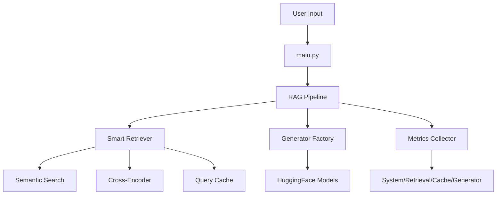

# System Architecture

Technical overview of the RAG system components and data flow.

---
## 🏗️ System Overview



**Core Flow:**
```
User Question → Retriever (fetch docs) → Generator (create answer) → Display + Metrics
```

---
## 📦 Core Components

### 1. RAG Pipeline

**File:** `pipeline/rag_pipeline.py`

The main orchestrator that connects all components.

```python
class RAGPipeline:
    def __init__(self, config_path="config/config.yaml"):
        # Load configuration
        self.config = yaml.safe_load(config_path)
        
        # Initialize components
        self.retriever = SmartRetriever(...)
        self.generator = GeneratorFactory.create_generator(...)
        self.metrics_collector = MetricsCollector()
    
    def run(self, question, filters=None):
        # 1. Retrieve relevant documents
        context = self.retriever.retrieve(question, filters)
        
        # 2. Generate answer using LLM
        answer, time = self.generator.generate(context, question)
        
        # 3. Track performance
        self.metrics_collector.track_generation(time)
        
        return context, answer
```

**Key Responsibilities:**
- Load and manage configuration from `config/config.yaml`
- Coordinate retrieval → generation workflow
- Handle model switching at runtime
- Aggregate metrics from all components

---
### 2. Smart Retriever

**File:** `retriever/smart_retriever.py`

Unified retrieval component that replaced 4 legacy classes.

**Architecture:**
```python
SmartRetriever(
    use_reranking=True,    # Enable cross-encoder reranking
    use_cache=True,        # Enable query caching
    use_filters=True,      # Enable metadata filtering
    use_metrics=True       # Enable performance tracking
)
```

**Retrieval Process:**

```
1. Check Cache
   ↓ (if miss)
2. Semantic Search (FAISS + Sentence-BERT)
   - Encode query to vector
   - Find top-k similar documents
   ↓
3. Apply Filters (if enabled)
   - Filter by file type (.pdf, .docx, etc)
   - Filter by source file name
   - Filter by date range
   - Filter by minimum similarity score
   ↓
4. Rerank Results (if enabled)
   - Use cross-encoder model
   - Re-score top candidates
   - Select best matches
   ↓
5. Cache Result
   ↓
6. Return to Pipeline
```

**Key Features:**
- **FAISS Index:** Efficient vector similarity search (cosine distance)
- **Sentence-BERT:** `all-MiniLM-L6-v2` for embeddings (384 dimensions)
- **Cross-Encoder:** `ms-marco-MiniLM-L-6-v2` for reranking
- **File Cache:** Stores queries with configurable TTL (default: 1 hour)
- **Metadata Filters:** Flexible filtering on document properties

**Configuration Example:**
```yaml
retriever:
  model_name: "all-MiniLM-L6-v2"
  embeddings_path: "data/embeddings.json"
  top_k: 5                    # Initial candidates
  use_reranking: true
  reranker_model: "cross-encoder/ms-marco-MiniLM-L-6-v2"
  rerank_top_k: 3            # Final results after reranking
  cache_enabled: true
  cache_ttl: 3600            # 1 hour in seconds
  metrics_enabled: true
```

---
### 3. Generator Factory

**File:** `generator/generator_factory.py`

Manages multiple LLM models with runtime switching capability.

**Supported Models:**

| Model | Parameters | Quantization | Speed (CPU) | Memory | Use Case |
|-------|-----------|--------------|-------------|--------|----------|
| **Bitnet** | 2B | 4-bit | ~80s | 2GB | General purpose, fast inference |
| **Gemma** | 2-7B | Optional | ~120s | 4-8GB | Instruction following, quality |
| **Llama** | 7-13B | 4/8-bit | ~180s | 8-16GB | Complex reasoning, research |

**Model Configuration:**
```yaml
default_model: "bitnet"

models:
  bitnet:
    path: "microsoft/bitnet-b1.58-2B-4T"
    type: "huggingface"
    quantization: "4bit"               # Reduces memory usage
    max_new_tokens: 250                # Output length limit
    temperature: 0.7                   # Creativity (0.0-1.0)
    
  gemma:
    path: "google/gemma-2b-it"
    type: "huggingface"
    quantization: null                 # No quantization
    max_new_tokens: 512
    temperature: 0.7
```

**Generation Flow:**
```python
1. Build Prompt
   "Context: {retrieved_docs}\nQuestion: {user_question}\nAnswer:"
   ↓
2. Tokenize Input
   Convert text to token IDs
   ↓
3. Model Inference
   Generate tokens autoregressively
   Track: tokens/second, total time
   ↓
4. Decode Output
   Convert token IDs back to text
   ↓
5. Return Answer + Metrics
```

**Runtime Model Switching:**
```python
# Switch without restart
pipeline.switch_model('gemma')

# Automatically:
# - Unloads current model
# - Loads new model from config
# - Preserves retriever and metrics
```

---
### 4. Metrics Collector

**File:** `utils/metrics/unified_metrics.py`

Centralized metrics tracking with unified dashboard.

**Architecture:**
```python
MetricsCollector:
    ├── system_monitor: SystemMetrics
    │   └── Tracks: CPU %, RAM usage, GPU utilization
    │
    ├── retrieval_tracker: RetrievalMetrics  
    │   └── Tracks: Query count, latency, results per query
    │
    ├── cache_tracker: CacheMetrics
    │   └── Tracks: Hit/miss rate, time saved
    │
    └── generator_tracker: GeneratorMetrics
        └── Tracks: Generation time, tokens/sec, success rate
```

**Dashboard Output:**
```
============================================================
              UNIFIED RAG METRICS DASHBOARD
============================================================
Session Start: 2025-10-15 14:30:00
============================================================

🖥️  SYSTEM RESOURCES:
   CPU: Avg 45.2%, Max 78.5%
   RAM: Avg 4.23GB, Max 6.15GB
   GPU: NVIDIA RTX 3080
        Avg 65.4%, Max 92.3%

🔍 RETRIEVAL:
   Total Queries: 15
   Avg Response Time: 0.234s
   Avg Results/Query: 5.0

💾 CACHE:
   Total Requests: 15
   Hit Rate: 40.0%
   Time Saved: 1.42s

🤖 GENERATOR:
   Total Generations: 15
   Avg Duration: 12.45s
   Avg Speed: 8.2 tokens/s
   Success Rate: 100.0%

============================================================
```

**Access:** Type `metrics` in CLI or call `pipeline.retriever.print_metrics_dashboard()`

---
## 🗂️ Project Structure

```
My-RAG-Template/
│
├── config/
│   └── config.yaml              # Central configuration (models, retriever, logging)
│
├── data/
│   ├── documents/               # Place your documents here (auto-scanned)
│   └── embeddings.json          # Generated vectors (auto-created)
│
├── generator/
│   ├── base_generator.py        # Abstract generator interface
│   ├── generator.py             # HuggingFace implementation
│   └── generator_factory.py     # Multi-model factory pattern
│
├── retriever/
│   ├── smart_retriever.py       # Main retriever (unified)
│   ├── semantic_retriever.py    # Base vector search (FAISS)
│   ├── faiss_index.py           # Vector index management
│   └── [legacy files]           # Backward compatibility
│
├── utils/
│   ├── metrics/
│   │   ├── unified_metrics.py   # MetricsCollector
│   │   ├── system_metrics.py    # CPU/RAM/GPU tracking
│   │   ├── retrieval_metrics.py # Query performance
│   │   ├── cache_metrics.py     # Hit rate tracking
│   │   └── generator_metrics.py # LLM performance
│   │
│   ├── document_parsers.py      # Multi-format parsing (8 formats)
│   └── query_cache.py           # File-based cache (TTL)
│
├── logger/
│   └── logger.py                # Centralized logging system
│
├── pipeline/
│   └── rag_pipeline.py          # Main orchestrator
│
└── main.py                      # CLI entry point
```

---
## 📊 Performance Characteristics

### Typical Query Latency (5 documents, 250 tokens)

| Component | CPU (no cache) | CPU (cached) | GPU |
|-----------|---------------|--------------|-----|
| Retrieval | 200ms | 5ms | 150ms |
| Reranking | 100ms | - | 50ms |
| Generation | 80s | 80s | 8s |
| **Total** | **~80.3s** | **~80s** | **~8.2s** |

### Memory Usage by Configuration

| Setup | RAM | Notes |
|-------|-----|-------|
| Bitnet 4-bit | ~2GB | Recommended for CPU |
| Gemma no quant | ~4GB | Better quality |
| Llama 8-bit | ~8GB | Best reasoning |
| Embeddings (1000 docs) | ~50MB | Persistent |

---
## 🎯 Design Decisions

### Why SmartRetriever?

**Problem:** Original architecture had 4 separate retriever classes chained together:
```python
semantic → reranking → cache → filtered
```

**Solution:** Single `SmartRetriever` with toggleable features.

**Benefits:**
- ✅ Simpler initialization (1 class vs 4)
- ✅ Easier testing (mock once vs 4 times)
- ✅ Better performance (shared state)
- ✅ Flexible configuration (enable/disable features)

### Why Generator Factory?

**Benefits:**
- ✅ Runtime model switching without restart
- ✅ Easy to add new models (just edit config)
- ✅ Consistent interface across models
- ✅ Configuration-driven (no code changes)

### Why Unified Metrics?

**Problem:** Metrics were scattered across components, hard to aggregate.

**Solution:** `MetricsCollector` as single source of truth.

**Benefits:**
- ✅ Consistent tracking API
- ✅ Unified dashboard view
- ✅ Performance insights (automatic recommendations)
- ✅ Easy to extend (add new metric tracker)

---
## 📚 Documentation

- [Installation Guide](docs/INSTALL.md) - Detailed setup instructions
- [Usage Examples](docs/USAGE_EXAMPLES.md) - Practical examples and use cases
- [HuggingFace Models Configuration](docs/HUGGINGFACE_CONFIGS.md) - Detailed HuggingFace configuration parameters